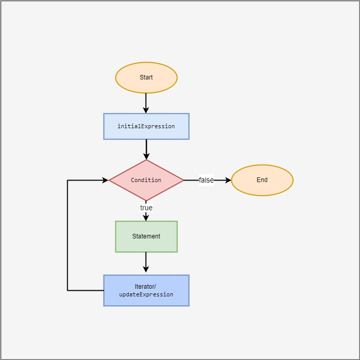
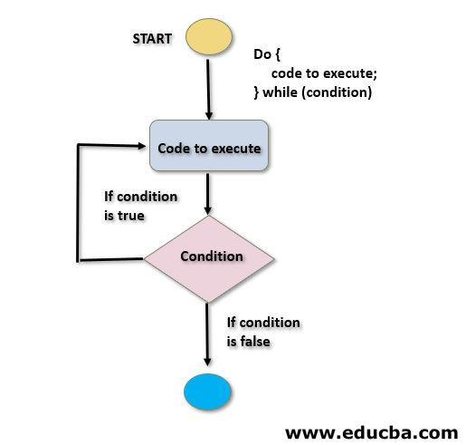
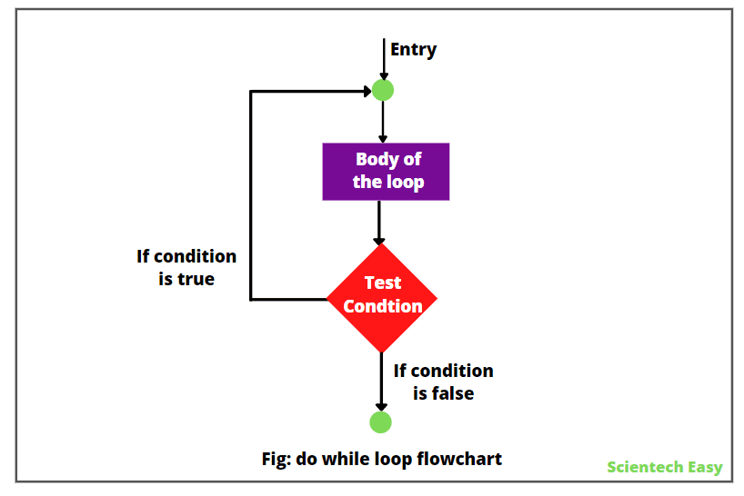
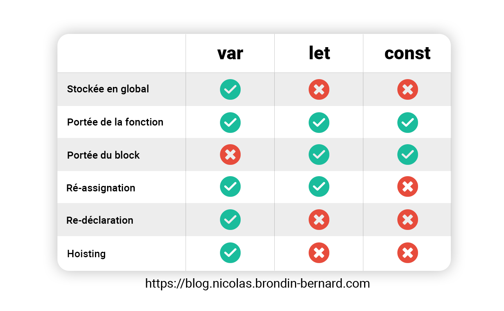
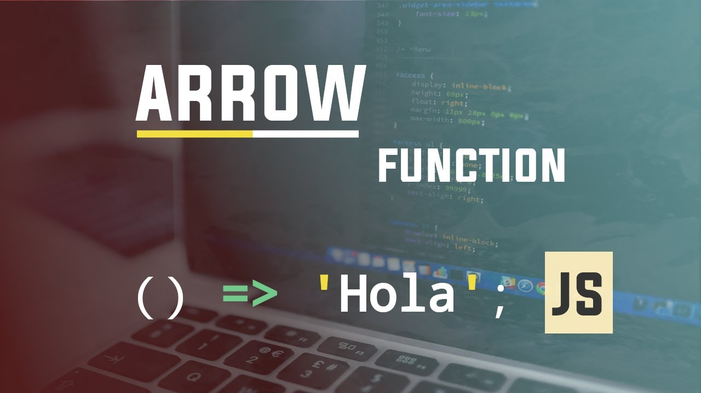
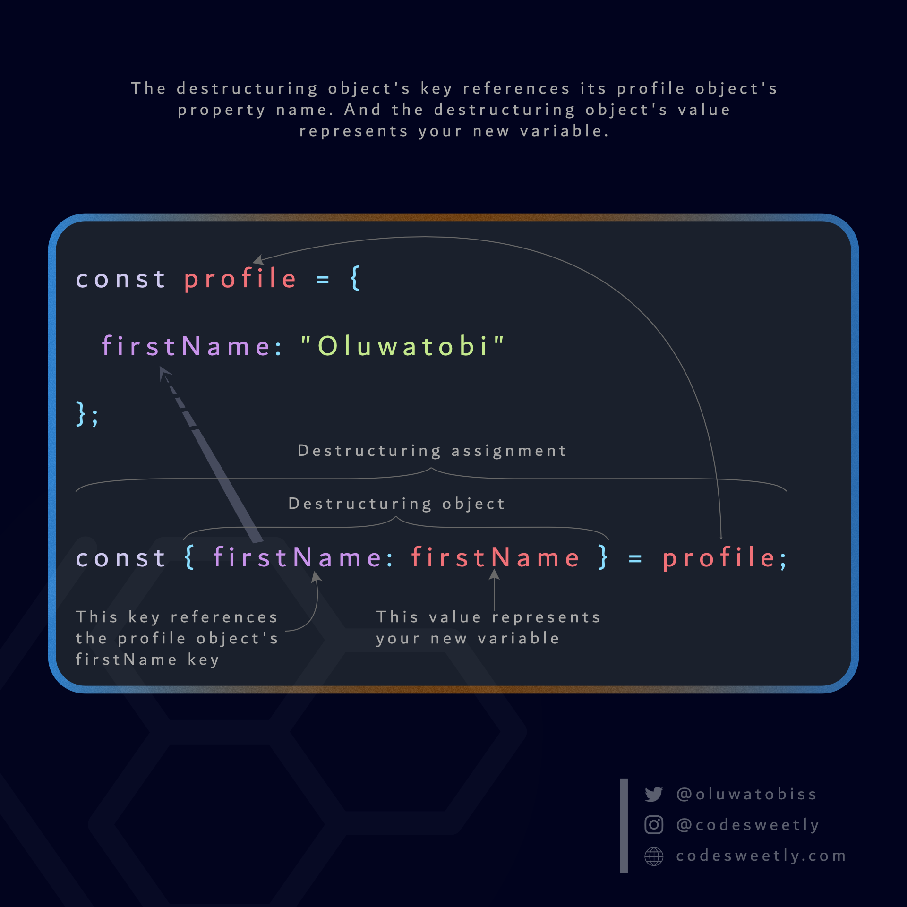
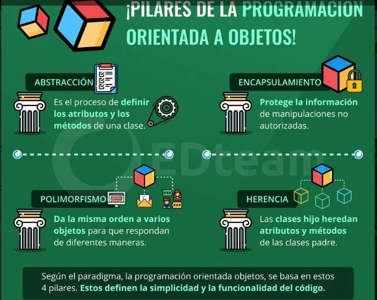
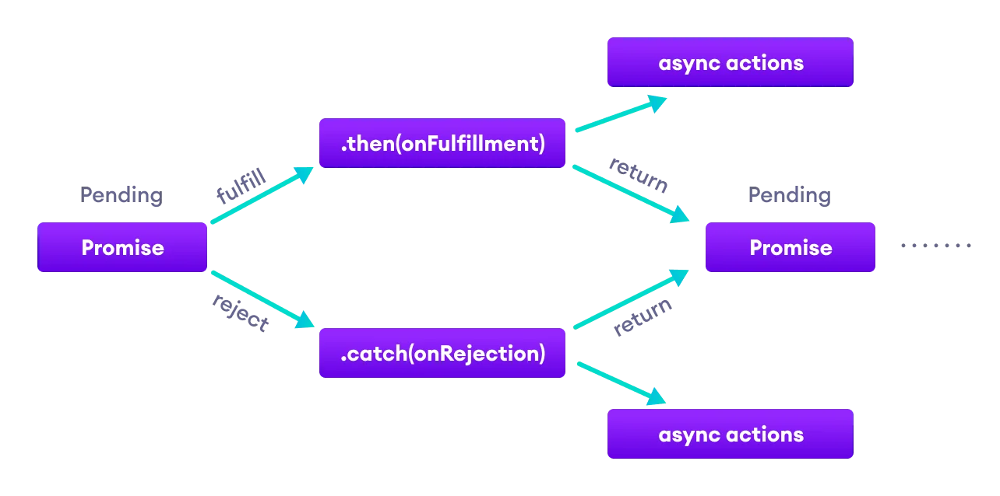

# ¿Qué tipo de bucles hay en JS?

Los bucles ofrecen una forma rápida y sencilla de hacer algo repetidamente. Puedes pensar en un bucle como una versión computarizada del juego en la que le dices a alguien que dé X pasos en una dirección y luego Y pasos en otra. Por ejemplo, la idea "Ve cinco pasos hacia el este" se podría expresar de esta manera como un bucle:

```JavaScript
for (let step = 0; step < 5; step++) {
  // Se ejecuta 5 veces, con valores del paso 0 al 4.
  console.log("Camina un paso hacia el este");
}

```

Hay muchos diferentes tipos de bucles, pero esencialmente, todos hacen lo mismo: repiten una acción varias veces. (¡Ten en cuenta que es posible que ese número sea cero!).

Los diversos mecanismos de bucle ofrecen diferentes formas de determinar los puntos de inicio y terminación del bucle. Hay varias situaciones que son fácilmente atendidas por un tipo de bucle que por otros.

## Declaración for



Un ciclo **for** se repite hasta que una condición especificada se evalúe como **false**. El bucle for de JavaScript es similar al bucle for de Java y C.

Una declaración for tiene el siguiente aspecto:

```JavaScript
for ([expresiónInicial]; [expresiónCondicional]; [expresiónDeActualización])
  instrucción
```

Cuando se ejecuta un bucle **for**, ocurre lo siguiente:

1. Se ejecuta la expresión de iniciación _expresiónInicial_, si existe. Esta expresión normalmente inicia uno o más contadores de bucle, pero la sintaxis permite una expresión de cualquier grado de complejidad. Esta expresión también puede declarar variables.
2. Se evalúa la expresión _expresiónCondicional_. Si el valor de _expresiónCondicional_ es verdadero, se ejecutan las instrucciones del bucle. Si el valor de _condición_ es falso, el bucle **for** termina. (Si la expresión _condición_ se omite por completo, se supone que la condición es verdadera).
3. Se ejecuta la _instrucción_. Para ejecutar varias instrucciones, usa una declaración de bloque _({ ... })_ para agrupar esas declaraciones.
4. Si está presente, se ejecuta la expresión de actualización _expresiónDeActualización_.
5. El control regresa al paso 2.

### Ejemplo

En el siguiente ejemplo, la función contiene una instrucción **for** que cuenta el número de opciones seleccionadas en una lista de desplazamiento (el elemento _\<select\>_ de HTML representa un control que proporciona un menú de opciones que permite múltiples selecciones). La instrucción **for** declara la variable _i_ y la inicia a _0_. Comprueba que _i_ es menor que el número de opciones en el elemento _\<select\>_, realiza la siguiente instrucción _if_ e incrementa _i_ después de cada pasada por el bucle.

```HTML
<form name="selectForm">
  <p>
    <label for="musicTypes"
      >Elija algunos tipos de música, luego haga clic en el botón de
      abajo:</label
    >
    <select id="musicTypes" name="musicTypes" multiple="multiple">
      <option selected="selected">R&B</option>
      <option>Jazz</option>
      <option>Blues</option>
      <option>New Age</option>
      <option>Classical</option>
      <option>Opera</option>
    </select>
  </p>
  <p><input id="btn" type="button" value="¿Cuántos están seleccionados?" /></p>
</form>

<script>
  function howMany(selectObject) {
    let numberSelected = 0;
    for (let i = 0; i < selectObject.options.length; i++) {
      if (selectObject.options[i].selected) {
        numberSelected++;
      }
    }
    return numberSelected;
  }

  let btn = document.getElementById("btn");
  btn.addEventListener("click", function () {
    alert(
      "Número de opciones seleccionadas: " +
        howMany(document.selectForm.musicTypes),
    );
  });
</script>
```

---

## Declaración do...while



La instrucción **do...while** se repite hasta que una condición especificada se evalúe como falsa.

Una declaración **do...while** tiene el siguiente aspecto:

```JavaScript
do
  expresión
while (condición);
```

_exposición_ siempre se ejecuta una vez antes de que se verifique la condición. (Para ejecutar varias instrucciones, usa una declaración de bloque _({ ... })_ para agrupar esas declaraciones).

Si _condición_ es _true_, la declaración se ejecuta de nuevo. Al final de cada ejecución, se comprueba la condición. Cuando la condición es _false_, la ejecución se detiene y el control pasa a la declaración que sigue a **do...while**.

### Ejemplo

En el siguiente ejemplo, el bucle **do** itera al menos una vez y se repite hasta que _i_ ya no sea menor que _5_.

```JavaScript
let i = 0; do { i += 1; console.log(i); } while (i < 5);
```

## Declaración while



Una declaración **while** ejecuta sus instrucciones siempre que una condición especificada se evalúe como _true_. Una instrucción **while** tiene el siguiente aspecto:

```JavaScript
while (condición)
  expresión
```

Si la _condición_ se vuelve _false_, la _instrucción_ dentro del bucle se deja de ejecutar y el control pasa a la instrucción que sigue al bucle.

La prueba de condición ocurre antes de que se ejecute la _expresión_ en el bucle. Si la condición devuelve _true_, se ejecuta la _expresión_ y la _condición_ se prueba de nuevo. Si la condición devuelve _false_, la ejecución se detiene y el control se pasa a la instrucción que sigue a **while**.

Para ejecutar varias instrucciones, usa una declaración de bloque _({ ... })_ para agrupar esas declaraciones.

### Ejemplo 1

El siguiente ciclo del **while** se repite siempre que _n_ sea menor que _3_:

```JavaScript
let n = 0;
let x = 0;
while (n < 3) {
  n++;
  x += n;
}
```

Con cada iteración, el bucle incrementa _n_ y agrega ese valor a _x_. Por lo tanto, _x_ y _n_ toman los siguientes valores:

Después de la primera pasada: _n = 1_ y _x = 1_
Después de la segunda pasada: _n = 2_ y _x = 3_
Después de la tercera pasada: _n = 3_ y _x = 6_
Después de completar la tercera pasada, la condición _n < 3_ ya no es _true_, por lo que el bucle termina.

### Ejemplo 2

Evita los bucles infinitos. Asegúrate de que la condición en un bucle eventualmente se convierta en _false_; de lo contrario, el bucle nunca terminará. Las declaraciones en el siguiente bucle _while_ se ejecutan indefinidamente porque la condición nunca se vuelve _false_:

```JavaScript
// ¡Los bucles infinitos son malos!
while (true) {
  console.log("¡Hola, mundo!");
}
```

## Declaración labeled

Una _label_ proporciona una instrucción con un identificador que te permite hacer referencia a ella en otra parte de tu programa. Por ejemplo, puedes usar una etiqueta para identificar un bucle y luego usar las declaraciones _break_ o _continue_ para indicar si un programa debe interrumpir el bucle o continuar su ejecución.La sintaxis de la instrucción etiquetada es similar a la siguiente:

```JavaScript
label : instrucción
```

El valor de _label_ puede ser cualquier identificador de JavaScript que no sea una palabra reservada. La _declaración_ que identifica a una etiqueta puede ser cualquier enunciado.

### Ejemplo

En este ejemplo, la etiqueta _markLoop_ identifica un bucle **while**.

```JavaScript
markLoop: while (theMark === true) { doSomething(); }
```

## Declaración break

Usa la instrucción _break_ para terminar un bucle, _switch_ o junto con una declaración etiquetada.

- Cuando usas _break_ sin una etiqueta, inmediatamente termina el _while_, _do-while_, _for_ o _switch_ y transfiere el control a la siguiente declaración.
- Cuando usas _break_ con una etiqueta, termina la declaración etiquetada especificada.

La sintaxis de la instrucción _break_ se ve así:

```JavaScript
break;
break [label];
```

1. La primera forma de la sintaxis termina el bucle envolvente más interno o el _switch_.
2. La segunda forma de la sintaxis termina la instrucción etiquetada específica.

### Ejemplo 1

El siguiente ejemplo recorre en iteración los elementos de un arreglo hasta que encuentra el índice de un elemento cuyo valor es _theValue_:

```JavaScript
for (let i = 0; i < a.length; i++) {
  if (a[i] === theValue) {
    break;
  }
}
```

### Ejemplo 2: romper una etiqueta

```JavaScript
let x = 0;
let z = 0;
labelCancelLoops: while (true) {
  console.log("Bucles externos: " + x);
  x += 1;
  z = 1;
  while (true) {
    console.log("Bucles internos: " + z);
    z += 1;
    if (z === 10 && x === 10) {
      break labelCancelLoops;
    } else if (z === 10) {
      break;
    }
  }
}
```

## Declaración continue

La instrucción _continue_ se puede usar para reiniciar un _while_, _do-while_, _for_, o declaración _label_.

- Cuando utilizas _continue_ sin una etiqueta, finaliza la iteración actual del _while_, _do-while_ o _for_ y continúa la ejecución del bucle con la siguiente iteración. A diferencia de la instrucción _break_, _continue_ no termina la ejecución del bucle por completo. En un bucle _while_, vuelve a la condición. En un bucle _for_, salta a la _expresión-incremento_.
- Cuando usas _continue_ con una etiqueta, se aplica a la declaración de bucle identificada con esa etiqueta.

La sintaxis de la instrucción _continue_ se parece a la siguiente:

```JavaScript
continue [label];
```

### Ejemplo 1

El siguiente ejemplo muestra un bucle _while_ con una instrucción _continue_ que se ejecuta cuando el valor de _i_ es _3_. Por lo tanto, _n_ toma los valores _1_, _3_, _7_ y _12_.

```JavaScript
let i = 0;
let n = 0;
while (i < 5) {
  i++;
  if (i === 3) {
    continue;
  }
  n += i;
  console.log(n);
}
//1,3,7,12

let i = 0;
let n = 0;
while (i < 5) {
  i++;
  if (i === 3) {
    // continue;
  }
  n += i;
  console.log(n);
}
// 1,3,6,10,15
```

### Ejemplo 2

Una declaración etiquetada _checkiandj_ contiene una declaración etiquetada _checkj_. Si se encuentra _continue_, el programa termina la iteración actual de _checkj_ y comienza la siguiente iteración. Cada vez que se encuentra _continue_, _checkj_ reitera hasta que su condición devuelve _false_. Cuando se devuelve _false_, el resto de la instrucción _checkiandj_ se completa y _checkiandj_ reitera hasta que su condición devuelve _false_. Cuando se devuelve _false_, el programa continúa en la declaración que sigue a _checkiandj_.

Si _continue_ tuviera una etiqueta de _checkiandj_, el programa continuaría en la parte superior de la declaración _checkiandj_.

```JavaScript
let i = 0; let j = 10; checkiandj: while (i < 4) { console.log(i); i += 1; checkj: while (j > 4) { console.log(j); j -= 1; if ((j % 2) === 0) { continue checkj; } console.log(j + 'es impar.'); } console.log('i = ' + i); console.log('j = ' + j); }
```

## Declaración for...in

La instrucción **for...in** itera una variable especificada sobre todas las propiedades enumerables de un objeto. Para cada propiedad distinta, JavaScript ejecuta las instrucciones especificadas. Una declaración _for...in_ tiene el siguiente aspecto:

```JavaScript
for (variable in objeto)
  instrucción
```

### Ejemplo

La siguiente función toma como argumento un objeto y el nombre del objeto. Luego itera sobre todas las propiedades del objeto y devuelve una cadena que enumera los nombres de las propiedades y sus valores.

```JavaScript
function dump_props(obj, obj_name) {
  let result = "";
  for (let i in obj) {
    result += obj_name + "." + i + " = " + obj[i] + "<br>";
  }
  result += "<hr>";
  return result;
}
```

Para un objeto _car_ con propiedades _make_ y _model_, _result_ sería:

```JavaScript
car.make = Ford;
car.model = Mustang;
```

### Arrays

Aunque puede ser tentador usar esto como una forma de iterar sobre los elementos _Array_, la instrucción _for...in_ devolverá el nombre de sus propiedades definidas por el usuario además de los índices numéricos.

Por lo tanto, es mejor usar un bucle _for_ tradicional con un índice numérico cuando se itera sobre arreglos, porque la instrucción _for...in_ itera sobre las propiedades definidas por el usuario además de los elementos del arreglo, si modificas el objeto _Array_ (tal como agregar propiedades o métodos personalizados).

## Declaración for...of

La declaración **for...of** crea un bucle que se repite sobre objetos iterables (incluidos _Array_, _Map_, _Set_, objetos _arguments_ y así sucesivamente), invocando un bucle de iteración personalizado con declaraciones que se ejecutarán para el valor de cada distinta propiedad.

```JavaScript
for (variable of objeto)
  expresión
```

El siguiente ejemplo muestra la diferencia entre un bucle _for...of_ y un bucle _for...in_. Mientras que _for...in_ itera sobre los nombres de propiedad, _for...of_ itera sobre los valores de propiedad:

```JavaScript
const arr = [3, 5, 7];
arr.foo = "hola";

for (let i in arr) {
  console.log(i); // logs "0", "1", "2", "foo"
}

for (let i of arr) {
  console.log(i); // logs 3, 5, 7
}
```

---

# ¿Cuáles son las diferencias entre const, let y var?

Analicemos **var**, **let** y **const**: su alcance, uso y valor.

## Var

Antes de que apareciera E6, las declaraciones **var** reinaban supremas. Sin embargo, existen problemas con las variables declaradas utilizando esta palabra clave. Es por eso que era necesario desarrollar nuevas formas de declarar variables. Primero comprendamos mejor var antes de discutir los problemas mencionados.

### Alcance var

El alcance esencialmente indica dónde están disponibles para su uso determinadas variables. Las declaraciones **Var** pueden tener visibilidad global o local (alcance dentro de la función).

La variable **var** es global cuando se declara fuera de una función. Esto significa que cualquier variable declarada con var fuera de un bloque de funciones está disponible para su uso en toda la ventana.

**Var** es local cuando se declara dentro de una función. Esto significa que es accesible y solo se puede acceder a él desde esa función.

Para entenderlo mejor, veamos un ejemplo:

```JavaScript
var greeter = "hey hi";

function newFunction() {
  var hello = "hello";
}
```

Aquí la variable _greeter_ es global porque está fuera de cualquier función y _hello_ está limitada a la función. Entonces no podemos acceder a la variable _hello_ desde fuera de la función. Entonces, si intentas hacerlo así:

```JavaScript
var tester = "hey hi";

function newFunction() {
  var hello = "hello";
}
console.log(hello); // error: hello is not defined
```

...habrá un error en la salida. Esto sucede porque no se puede acceder a la variable _hello_ fuera de la función específica.

### Las variables var se pueden volver a declarar o actualizar

Esto significa que podemos hacer esto dentro del alcance apropiado y no obtener un error.

```JavaScript
var greeter = "hey hi";
var greeter = "say Hello instead";
```

O incluso así:

```JavaScript
var greeter = "hey hi";
greeter = "say Hello instead";
```

### Elevando var

El levantamiento es un mecanismo en JavaScript mediante el cual las variables y declaraciones de funciones se mueven a la parte superior de su alcance antes de que comience la ejecución del código. Esto significa que si lo haces así:

```JavaScript
console.log (greeter);
var greeter = "say hello"
```

...entonces se interpretará así:

```JavaScript
var greeter;
console.log(greeter); // greeter is undefined
greeter = "say hello"
```

Por lo tanto, las variables **var** se elevan a la parte superior de su alcance y se inicializan con el valor _undefined_.

### Problema con var

Hay una debilidad que viene con **var**. Para explicarlo, pondré un ejemplo a continuación:

```JavaScript
var greeter = "hey hi";
var times = 4;

if (times > 3) {
  var greeter = "say Hello instead";
}

console.log(greeter) // "say Hello instead"
```

Como puede ver, dado que _times > 3_ devuelve _true_, el valor de la variable _greeter_ se redefine como "say Hello instead". Aunque esto no es un problema si deliberadamente desea lograr dicha anulación para _greeter_. El problema viene cuando no te das cuenta de que la variable _greeter_ ya ha sido definida.

Si ha utilizado _greeter_ en otras partes de su código, se sorprenderá con el resultado que obtendrá. Esto seguramente causará muchos errores en su código. Por eso entra en juego la necesidad de **let** y **const**.

## Let

**let** es ahora la opción preferida para declarar variables. Como era de esperar, **let** actúa como una mejora de la declaración **var** y también resuelve el problema con **var** que acabamos de comentar.

### let tiene alcance de bloque

Un bloque es un fragmento de código delimitado por llaves **{}**. Todo lo que está dentro de las llaves pertenece al bloque.

Por lo tanto, una variable declarada en un bloque mediante **let** solo será accesible dentro de ese bloque. Veamos un ejemplo:

```JavaScript
let greeting = "say Hi";
let times = 4;

if (times > 3) {
  let hello = "say Hello instead";
  console.log(hello);// "say Hello instead"
}
console.log(hello) // hello is not defined
```

Aquí puede ver que intentar usar _hello_ fuera del bloque (las llaves dentro de las cuales se definió la variable) devuelve un error. Esto sucede porque las variables **let** son variables de bloque.

### Las variables let se pueden actualizar pero no volver a declarar.

Al igual que con **var\***, las variables declaradas con **let** se pueden actualizar dentro de su alcance. Pero, a diferencia de **var**, las variables **let** no se pueden volver a declarar dentro del alcance. Aunque esto funcionará:

```JavaScript
let greeting = "say Hi";
greeting = "say Hello instead";
```

este código ya devolverá un error:

```JavaScript
let greeting = "say Hi";
let greeting = "say Hello instead"; // error: Identifier 'greeting' has already been declared
```

Sin embargo, si una variable con el mismo nombre se define en diferentes ámbitos, no habrá ningún error:

```JavaScript
let greeting = "say Hi";
  if (true) {
    let greeting = "say Hello instead";
    console.log(greeting); // "say Hello instead"
  }
console.log(greeting); // "say Hi"
```

¿Por qué no hay ningún error? Esto sucede porque ambas instancias se tratan como variables diferentes porque tienen alcances diferentes.

Esto es lo que hace que **let** sea una mejor opción que **var**. Al usar **let**, no tiene que preocuparse por si ya tiene una variable con ese nombre antes, porque la variable solo existe dentro de su alcance.

Además, dado que una variable dentro de un alcance específico solo se puede declarar una vez, el problema que discutimos anteriormente con respecto a **var** ya no se aplica.

### Levantando let

Al igual que con **var**, las declaraciones hasta **let** se mueven hacia arriba. Pero a diferencia de las variables **var**, que se inicializan como _undefined_, la palabra clave **let** no se inicializa. Entonces, si intenta utilizar una variable **let** antes de haberla declarado, obtendrá un _ReferenceError_.

## Const

Las variables declaradas con **const** almacenan valores constantes. Las declaraciones que utilizan **const** tienen algunas similitudes con las declaraciones que utilizan **let**.

### const tiene alcance de bloque

Al igual que con **let**, solo se puede acceder a las variables declaradas usando **const** dentro del bloque donde fueron declaradas.

### Las variables const no se pueden actualizar ni volver a declarar.

Esto significa que el valor de una variable declarada como **const** permanece sin cambios dentro de su alcance. No se puede actualizar ni volver a declarar. Entonces, si declaramos una variable **const**, no podemos hacer nada como esto:

```JavaScript
const greeting = "say Hi";
greeting = "say Hello instead";// error: Assignment to constant variable.
```

...así no:

```JavaScript
const greeting = "say Hi";
const greeting = "say Hello instead";// error: Identifier 'greeting' has already been declared
```

Por lo tanto, cada declaración mediante "const" debe inicializarse en el momento de la declaración.

Este comportamiento es ligeramente diferente cuando se trata de objetos declarados mediante **const**. Aunque un objeto **const** no se puede actualizar, las propiedades de dichos objetos se pueden actualizar. Por lo tanto, si declaras un objeto **const** como este:

```JavaScript
const greeting = {
  message: "say Hi",
  times: 4
}
```

... entonces, no hagamos esto:

```JavaScript
const greeting = {
  words: "Hello",
  number: "five"
} // error:  Assignment to constant variable.
```

Podemos hacer algo más:

```JavaScript
greeting.message = "say Hello instead";

```

Esto actualizará el valor de _greeting.message_ sin obtener un resultado de error.

### Levantando const

Al igual que **let**, las declaraciones realizadas mediante **const** ascienden, pero no se inicializan.

Entonces, en caso de que no hayas entendido las diferencias, aquí las tienes resumidas:

1. Las variables declaradas con **var** pueden ser globales o tener alcance de función; **let** y **const** tienen alcance de bloque.
2. Las variables **var** se pueden actualizar y redefinir dentro del alcance; las variables **let** se pueden actualizar, pero no redefinir; Las variables **const** no se pueden actualizar ni redefinir.
3. Con todos ellos, la zona de visibilidad se eleva al máximo. Pero si las variables **var** se inicializan como _undefined_, **let** y **const** no se inicializan.
4. Mientras que **var** y **let** pueden declararse pero no inicializarse, **const** debe inicializarse en el momento de la declaración.



---

# ¿Qué es una función de flecha?



Una de las innovaciones más notables en JavaScript moderno es la introducción de _arrow function_, a veces llamadas _fat arrow function_. Al declarar tales funciones, se utiliza una combinación especial de símbolos - =>.

Las funciones de flecha tienen dos ventajas principales sobre las funciones tradicionales. La primera es una sintaxis muy conveniente y compacta. La segunda es que el enfoque para trabajar con el valor de **this** en funciones de flecha parece más intuitivo que en funciones normales.

A veces, estas y otras ventajas llevan al hecho de que la sintaxis de flechas tiene preferencia incondicional sobre otros métodos de declaración de funciones.

Sin embargo, al igual que otros conceptos y mecanismos utilizados en programación, las funciones de flecha tienen sus ventajas y desventajas. Su uso puede provocar efectos secundarios negativos. Para utilizar correctamente las funciones de flecha, debe conocer los posibles problemas asociados con ellas.

## Características de las funciones de flecha en JavaScript

Las funciones de flecha en JavaScript son similares a las funciones lambda en Python y a los bloques en Ruby.

Son funciones anónimas con una sintaxis especial que toman un número fijo de argumentos y operan en el contexto del alcance que las incluye, es decir, en el contexto de la función u otro código en el que están declaradas.

### Sintaxis de la función de flecha

Las funciones de flecha se construyen según un esquema único y la estructura de las funciones puede, en casos especiales, simplificarse. La estructura básica de una función de flecha se ve así:

```JavaScript
(argument1, argument2, ... argumentN) => {
  // function
}
```

La lista de argumentos de la función está entre paréntesis, seguida de una flecha formada por los símbolos = y >, y luego el cuerpo de la función entre llaves.

Esto es muy similar a cómo se construyen las funciones normales, la principal diferencia es que se omite la palabra clave **function** y se agrega una flecha después de la lista de argumentos.

Sin embargo, en ciertos casos, las funciones de flecha simples se pueden declarar usando construcciones mucho más compactas.

Consideremos una variante de la sintaxis que se utiliza si el cuerpo de la función está representado por una sola expresión. Le permite prescindir de las llaves que enmarcan el cuerpo de la función y elimina la necesidad de devolver explícitamente los resultados de la evaluación de una expresión, ya que este resultado se devolverá automáticamente. Por ejemplo, podría verse así:

```JavaScript
const add = (a, b) => a + b;
```

Aquí hay otra versión abreviada de la función, que se usa cuando la función tiene un solo argumento.

```JavaScript
const getFirst = array => array[0];
```

Como puede ver, se han omitido los paréntesis que enmarcan la lista de argumentos. Además, el cuerpo de la función, que en este ejemplo está representado por un comando, también está escrito sin paréntesis. Más adelante hablaremos más sobre las ventajas de este tipo de estructuras.

### Devolución de objetos y taquigrafía de funciones de flecha

Cuando se trabaja con funciones de flecha, existen algunas estructuras sintácticas más complejas que es útil tener en cuenta.

Por ejemplo, intentemos usar una expresión de una línea para devolver un objeto literal de una función. Podría parecer, dado lo que ya sabemos sobre las funciones de flecha, que la declaración de la función se vería así:

```JavaScript
(name, description) => {name: name, description: description};
```

El problema con este código es su ambigüedad. Es decir, las llaves que queremos usar para describir un objeto literal parecen como si estuviéramos intentando encerrar el cuerpo de una función dentro de ellas.

Para indicarle al sistema que nos referimos a un objeto literal, debemos encerrarlo entre paréntesis:

```JavaScript
(name, description) => ({name: name, description: description});
```

### Funciones de flecha y su contexto de ejecución circundante

A diferencia de otras funciones, las funciones de flecha no tienen su propio contexto de ejecución.

En la práctica, esto significa que heredan las entidades **this** y **arguments** de la función principal.

Por ejemplo, compare las dos funciones presentadas en el siguiente código. Uno de ellos es normal, el segundo es una flecha.

```JavaScript
const test = {
  name: 'test object',
  createAnonFunction: function() {
    return function() {
      console.log(this.name);
      console.log(arguments);
    };
  },

  createArrowFunction: function() {
    return () => {
      console.log(this.name);
      console.log(arguments);
    };
  }
};
```

Hay un objeto de _test_ con dos métodos. Cada uno de ellos es una función que crea y devuelve una función anónima. La única diferencia entre estos métodos es que el primero usa una expresión de función tradicional y el segundo usa una función de flecha.

Si experimentamos con este código en la consola, pasando los mismos argumentos a los métodos del objeto, aunque los métodos se ven muy similares, obtenemos resultados diferentes:

```JavaScript
> const anon = test.createAnonFunction('hello', 'world');
> const arrow = test.createArrowFunction('hello', 'world');

> anon();
undefined
{}
> arrow();
test object
{ '0': 'hello', '1': 'world' }
```

Una función anónima tiene su propio contexto, por lo que cuando se llama, llamar a _test.name_ no devolverá el valor de la propiedad _name_ del objeto y llamar a _arguments_ no enumerará los argumentos de la función que se utilizó para crear y devolver la función que se está examinando.

En el caso de una función de flecha, resulta que su contexto coincide con el contexto de la función que la creó, lo que le da acceso tanto a la lista de argumentos pasados por esta función como a la propiedad nombre del objeto cuyo método la función es.

## Situaciones en las que las funciones de flecha mejoran el código

### Procesamiento de listas de valores

Las funciones lambda tradicionales, así como las funciones de flecha, después de su aparición en JavaScript, generalmente se usan en una situación en la que se aplica una determinada función a cada elemento de una determinada lista.

Por ejemplo, si tiene una matriz de valores que desea transformar utilizando el método de matriz _map_, una función de flecha es ideal para describir dicha transformación:

```JavaScript
const words = ['hello', 'WORLD', 'Whatever'];
const downcasedWords = words.map(word => word.toLowerCase());
```

A continuación se muestra un ejemplo extremadamente común de este tipo de uso de funciones de flecha, que implica trabajar con propiedades de objetos:

```JavaScript
const names = objects.map(object => object.name);

```

Del mismo modo, si se utilizan bucles _forEach_ modernos basados en iteradores en lugar de bucles for tradicionales, el hecho de que las funciones de flecha utilicen **this** de la entidad principal hace que su uso sea intuitivo:

```JavaScript
this.examples.forEach(example => {
  this.runExample(example);
});
```

### Promesas y cadenas de promesas.

Otra situación en la que las funciones de flecha le permiten escribir código más limpio y comprensible está representada por construcciones de programación asincrónicas.

Por tanto, las promesas simplifican enormemente el trabajo con código asincrónico. Al mismo tiempo, incluso si prefiere utilizar el diseño async/await, no puede prescindir de comprender las promesas, ya que este diseño se basa en ellas.

Sin embargo, cuando se utilizan promesas, es necesario declarar funciones que se llaman después de que se haya completado la ejecución del código asincrónico o de que se haya completado una llamada asincrónica a alguna API.

Este es un lugar ideal para usar funciones de flecha, especialmente si la función resultante tiene algún estado, una referencia a algo en un objeto. Por ejemplo, podría verse así:

```JavaScript
this.doSomethingAsync().then((result) => {
  this.storeResult(result);
});
```

### Transformando objetos

Otro ejemplo común de uso de funciones de flecha es encapsular transformaciones de objetos.

Por ejemplo, en Vue.js existe un patrón común que consiste en incluir fragmentos de almacenamiento de Vuex directamente en un componente de Vue utilizando mapState.

Esta operación implica declarar un conjunto de "transformadores" que seleccionan del estado completo original exactamente lo que se necesita para un componente en particular.

Transformaciones simples como estas son el lugar perfecto para usar funciones de flecha. Por ejemplo:

```JavaScript
export default {
  computed: {
    ...mapState({
      results: state => state.results,
      users: state => state.users,
    });
  }
}
```

## Situaciones en las que no debes utilizar funciones de flecha

### Métodos de objetos

Hay una serie de situaciones en las que utilizar funciones de flecha no es una buena idea. Las funciones de flecha, si se usan sin pensar, no solo no ayudan a los programadores, sino que también se convierten en una fuente de problemas.

La primera situación de este tipo es cuando se utilizan funciones de flecha como métodos en objetos. Aquí son importantes el contexto de ejecución y la palabra clave **this**, típica de las funciones tradicionales.

Hubo un tiempo en que era popular usar una combinación de propiedades de clase y funciones de flecha para crear métodos "enlazados automáticamente", es decir, métodos que los controladores de eventos pueden usar pero que permanecen vinculados a la clase. Se parecía a esto:

```JavaScript
class Counter {
  counter = 0;

  handleClick = () => {
    this.counter++;
  }
}
```

Cuando se utiliza una construcción como esta, incluso si la función _handleClick_ fuera llamada por un controlador de eventos y no en el contexto de una instancia de la clase _Counter_, la función tendría acceso a los datos de esa instancia.

Si bien usar una función de flecha aquí es sin duda una forma atractiva de vincular una función, el comportamiento de la función dista mucho de ser intuitivo en muchos sentidos, lo que dificulta las pruebas y causa problemas en situaciones en las que, por ejemplo, el objeto correspondiente se utiliza como prototipo. .

En tales casos, en lugar de funciones de flecha, utilice funciones normales y, si es necesario, vincúleles una instancia de objeto en el constructor:

```JavaScript
class Counter {
  counter = 0;

  handleClick() {
    this.counter++;
  }

  constructor() {
    this.handleClick = this.handleClick.bind(this);
  }
}
```

### Largas cadenas de llamadas

Las funciones de flecha pueden volverse problemáticas si planea usarlas en muchas combinaciones diferentes, particularmente en largas cadenas de llamadas a funciones.

La razón principal de estos problemas, al igual que con las funciones anónimas, es que producen seguimientos de pila de llamadas extremadamente poco informativos.

Esto no es tan malo si, por ejemplo, solo hay un nivel de anidamiento de llamadas a funciones, digamos, si estamos hablando de una función utilizada en un iterador. Sin embargo, si todas las funciones utilizadas se declaran como funciones de flecha y estas funciones se llaman entre sí, si ocurre un error, no será fácil entender lo que está sucediendo. Los mensajes de error se verán así

```JavaScript
{anonymous}()
{anonymous}()
{anonymous}()
{anonymous}()
{anonymous}()
```

### Funciones con contexto dinámico

La última situación que discutiremos donde las funciones de flecha pueden causar problemas es cuando se usan cuando se necesita un enlace dinámico **this**.

Si se utilizan funciones de flecha en situaciones como esta, el enlace dinámico **this** no funcionará. Esta desagradable sorpresa puede hacer que aquellos que tienen que trabajar con código en el que las funciones de flecha se utilizan incorrectamente se devanen los sesos pensando en las razones de lo que está sucediendo.

Aquí hay algunas cosas a tener en cuenta al considerar el uso de funciones de flecha:

Los controladores de eventos se llaman con **this** vinculado al atributo de evento _currentTarget_.
Si todavía estás usando _jQuery_, ten en cuenta que la mayoría de los métodos _jQuery_ vinculan **this** al elemento DOM seleccionado.
Si está utilizando Vue.js, los métodos y funciones calculadas normalmente vinculan **this** al componente Vue.

Por supuesto, las funciones de flecha se pueden utilizar intencionalmente para cambiar el comportamiento estándar de los mecanismos del software. Pero, especialmente en el caso de jQuery y Vue, esto a menudo entra en conflicto con el funcionamiento normal del sistema, lo que hace que el programador no pueda entender por qué un código que parece bastante normal de repente se niega a funcionar.

---

# ¿Qué es la deconstrucción de variables?

La desestructuración es una sintaxis que le permite descomprimir valores de matrices o propiedades de objetos en variables.

## Desestructuración de objetos

Primero, veamos la desestructuración de objetos. Y, por ejemplo, tomemos un objeto: un cliente.

```JavaScript
const customer = {
  name: 'Sherlock',
  email: 's.h.@gmail.com',
  age: 34,
  address: {
    streetNo: '221b Baker Street',
    city: 'London',
    country: 'UK'
  }
}
```

### Asignación de variables básicas

Si necesitáramos obtener _name_ y _email_, de la forma habitual haríamos esto:

```JavaScript
const name = customer.name;
const email = customer['email'];

console.log(name); // Sherlock
console.log(email); // s.h@gmaill.com
```

Con la desestructuración podemos hacer esto:

```JavaScript
const { name, email } = customer;

console.log(name); // Sherlock
console.log(email); // s.h@gmaill.com
```

Como mínimo, ya no escribimos _customer_ dos veces y nos sentimos un poco mejor.

Pero si queremos escribir _customer.name_ en una variable con un nombre diferente, ¿necesitamos la forma tradicional nuevamente? No, también podemos hacer esto:

```JavaScript
const { name: customerName, email } = customer;

console.log(customerName); // Sherlock
```

### Asignar valores a variables declaradas

Si queremos asignar valores a variables existentes, hacemos casi lo mismo, pero sumamos ().

```JavaScript
let name, email;

({ name, email } = customer);

console.log(name);
console.log(email);
```

¿Por qué agregamos ()?

{ en el lado izquierdo se considera un bloque, no un objeto literal. Si omite (), obtendrá un error:

```JavaScript
{ name, email } = customer;
            	^SyntaxError: Unexpected token '='
```

### Objetos anidados

Entonces nos dimos cuenta de que esto es conveniente, podemos complicarlo. Si queremos acceder a las propiedades _city_ y _country_, de forma tradicional debemos utilizar una cadena de llamadas:

```JavaScript
const name = customer.name;
const streetNo = customer.address.streetNo;
const city = customer['address']['city'];

console.log(name); // Sherlock
console.log(streetNo); // 221b Baker Street
console.log(city); // London
```

Podemos hacer lo mismo, pero más corto, usando la desestructuración:

```JavaScript
const { name, address: { streetNo, city } } = customer;

console.log(name); // Sherlock
console.log(streetNo); // 221b Baker Street
console.log(city); // UK
```

Puede parecer más complicado, pero es una cuestión de costumbre. Y sí, todavía podemos escribir las propiedades _streetNo_ y _city_ en variables con un nombre diferente.

### Valor por defecto

Adelante. Ahora nos enfrentamos a la tarea de agregar _married_ a nuestro objeto _customer_. Posibles opciones de respuesta: “sí” o “no” (no). Si no se especifica, asigne el valor “sin respuesta” (N/A).

Sin desestructurar haríamos esto:

```JavaScript
let married = customer.married;

console.log(married); // undefined

if (!married) {
  married = 'N/A';
}
console.log(married); // N/A
```

Pero con la desestructuración podemos declarar valores predeterminados, eliminando así la condición. ¿Fantástico?

```JavaScript
const { name, married = 'N/A' } = customer;

console.log(name); // Sherlock
console.log(married); // N/A
```

### Parámetros de objeto residuales

Imaginemos que necesitamos obtener solo _name_ (por ejemplo, asignarle un valor predeterminado) y escribir todo lo demás "tal cual" en otra variable.

```JavaScript
const { name = 'Default', ...rest } = customer;

console.log(name); // Sherlock
console.log(rest);
// {
//  email: 's.h@gmaill.com',
//  age: null,
//  address: { streetNo: '221b Baker Street', city: 'London', country: 'UK' }
// }
```

Ten en cuenta que puedes usar cualquier otro nombre de variable en lugar de _rest_, solo recuerda poner... y colocarlo al final.

### Desestructurando null

Vale la pena tener en cuenta que **null** no se puede desestructurar; obtendremos un error:

```JavaScript
function getCustomer() {
return null;
}

let { name, email } = getCustomer();
// TypeError: Cannot destructure property name of 'undefined' or 'null'.
```

Entonces tenemos que manejar casos como este:

```JavaScript
let { name = 'Hello', email = null } = getCustomer() || {};

console.log(name, email); // Hello null
```

### Argumentos de la función desestructurante

¿Intentemos utilizar la desestructuración para simplificar el trabajo con argumentos de funciones? Imaginemos que necesitamos una función que muestre el nombre y la ciudad del cliente en la consola.

Como hubiéramos hecho antes:

```JavaScript
let display = (customer) => console.log(`${customer.name} ${customer.address.city}`);

display(customer); // Sherlock London
```

Cómo haremos ahora:

```JavaScript
let display = ( { name, address: { city } } ) => console.log(`${name} ${city}`);

display(customer); // Sherlock London
```

## Desestructuración de matrices

Sí, esto también funciona con matrices. Por ejemplo, necesitaremos una bolsa de fruta.

```JavaScript
const fruits = ['Banana', 'Orange', 'Apple', 'Mango'];

```

### Desestructuración básica de matrices

Si necesitáramos conseguir un plátano y una naranja, previamente habríamos hecho lo siguiente:

```JavaScript
let firstFruit = fruits[0];
let secondFruit = fruits[1];

console.log(firstFruit); // Banana
console.log(secondFruit); // Orange
```

```JavaScript
¡Pero hoy no, hoy nos encontramos con la desestructuración!
```

```JavaScript
let [firstFruit, secondFruit, thirdFruit] = fruits;

console.log(firstFruit); // Banana
console.log(secondFruit); // Orange
console.log(thirdFruit); // Apple
```

### Saltarse elementos

En los objetos, podríamos recuperar cualquier valor de propiedad por nombre y escribirlo en variables. ¿Qué pasa si solo queremos obtener la primera y tercera fruta de la matriz? Sólo necesitamos agregar una coma adicional.

```JavaScript
let [firstFruit, , thirdFruit] = fruits;

```

Sí, sí, no especificamos el nombre de la variable y se omite el segundo elemento.

### Parámetros de matriz residual

Y en los arrays también podemos utilizar parámetros residuales. Por ejemplo, queremos coger la primera fruta para nosotros, dejar la segunda en la bolsa y darle el resto a nuestros amigos:

```JavaScript
let [yourFav, , ...friendsFav] = fruits;

console.log(yourFav); // Banana
console.log(friendsFav); // [ 'Apple', 'Mango' ]
```

### Reemplazo de valores

Y al final, concéntrate. Ahora intercambiaremos los lugares de la primera y segunda fruta sin declarar una nueva variable para esto.

```JavaScript
let [firstFruit, secondFruit] = fruits;

console.log(firstFruit); // Banana
console.log(secondFruit); // Orange

[firstFruit, secondFruit] = [secondFruit, firstFruit]

console.log(firstFruit); // Orange
console.log(secondFruit); // Banana
```

La destreza de la desestructuración y el no fraude.



***

# ¿Qué hace el operador de extensión en JS?

En JavaScript, el operador de extensión es azúcar sintáctico que le permite distribuir una colección de elementos (una matriz o un objeto) en otra colección.

Le permite trabajar de manera más eficiente con matrices, objetos y funciones, le permite crear nuevas colecciones basadas en las antiguas y simplifica significativamente el código.

JavaScript está en constante evolución y en él aparecen diversas innovaciones y mejoras. Una de esas innovaciones introducidas en ES6 es el operador de extensión. Parece una elipsis (...). Este operador le permite separar iterables donde se espera ninguno o uno o más argumentos. Las definiciones secas suelen ser difíciles de entender sin ejemplos prácticos. Por lo tanto, veamos varias opciones para usar el operador de extensión que lo ayudarán a comprender su esencia.

## Sintaxis del operador de extensión en JavaScript

La sintaxis del operador de extensión es muy sencilla y clara:

- para una matriz: ...array
- para objeto: ...object

## Insertar matrices en otras matrices

Eche un vistazo a este código. El operador de extensión no se utiliza aquí:

```JavaScript
var mid = [3, 4];
var arr = [1, 2, mid, 5, 6];

console.log(arr);
```

Arriba creamos una matriz _mid_. Luego se crea una segunda matriz, _arr_, que contiene la matriz _mid_. Al final del programa, la matriz _arr_ se imprime en la consola. ¿En qué crees que se convertirá esta matriz después de agregarle la matriz _mid_? Echemos un vistazo a lo que genera el programa:

```JavaScript
[1, 2, [3, 4], 5, 6]
```

¿Pensaste que esto sucedería?

Al insertar la matriz _mid_ en la matriz _arr_, terminamos con una matriz anidada dentro de otra. Si esto es exactamente lo que se necesitaba, entonces no hay nada de qué quejarse. Sin embargo, ¿qué pasaría si el propósito de escribir el código anterior fuera obtener una serie de números del 1 al 6? Para lograr este objetivo, puede utilizar el operador de extensión. Recuerde que este operador le permite dividir matrices en elementos individuales.

Considere el siguiente ejemplo. Todo aquí, excepto un lugar, es exactamente igual que en el fragmento de código anterior. La diferencia es que el operador de extensión ahora se usa para insertar el contenido de la matriz _mid_ en la matriz _arr_:

```JavaScript
var mid = [3, 4];
var arr = [1, 2, ...mid, 5, 6];

console.log(arr);
```

Si se ejecuta este código, el resultado será el siguiente:

```JavaScript
[1, 2, 3, 4, 5, 6]

```

Recuerde la descripción del operador de extensión que se encuentra al principio del material. Lo acabas de ver en acción. Como puede ver, cuando creamos una matriz arr y usamos el operador de extensión en la matriz _mid_, en lugar de insertar otra matriz en una matriz como un objeto, esa otra matriz se "divide en pedazos". Dividir la matriz insertada en nuestro caso significa que todos los elementos de esta matriz, uno por uno, se agregarán a la matriz _arr_. Como resultado, en lugar de una construcción de matrices anidadas, obtuvimos una matriz que contiene los números del 1 al 6.

### Fusionando dos matrices

```JavaScript
const arr1 = [1, 2, 3];
const arr2 = [4, 5, 6];
const arr3 = [...arr1, ...arr2];
console.log(arr3); // [1, 2, 3, 4, 5, 6]
```

### Usar con función

```JavaScript
const arr = [1, 2, 3];
function sum(a, b, c) {
  return a + b + c;
}
console.log(sum(...arr)); // 6
```

## Calculos matematicos

JavaScript tiene un objeto _Math_ incorporado que le permite realizar cálculos matemáticos. En este ejemplo, estamos interesados en el método _Math.max()_. Si no está familiarizado con este método, le informamos que devuelve el número más grande que se le pasa y está permitido usarlo sin argumentos o con uno o más argumentos. Aquí hay unos ejemplos:

```JavaScript
Math.max();
// -Infinity
Math.max(1, 2, 3);
// 3
Math.max(100, 3, 4);
// 100
```

Como puede ver, si desea encontrar el valor máximo de varios números, _Math.max()_ necesita varios parámetros. Desafortunadamente, si necesita encontrar el elemento máximo de una matriz numérica, no puede pasar la matriz al método _Math.max()_. Antes de la introducción del operador de dispersión en JS, la forma más sencilla de encontrar el elemento máximo en una matriz usando _Math.max()_ era usar el método _apply()_:

```JavaScript
var arr = [2, 4, 8, 6, 0];

function max(arr) {
  return Math.max.apply(null, arr);
}

console.log(max(arr));
```

Arriba hay un diseño que funciona, pero no se ve muy bien.

Y así es como se hace lo mismo usando el operador de extensión:

```JavaScript
var arr = [2, 4, 8, 6, 0];
var max = Math.max(...arr);

console.log(max);
```

En lugar de crear una función y usar el método _apply()_ para devolver el resultado del método _Math.max()_, solo requiere dos líneas de código. El operador de expansión "saca" todos sus elementos de la matriz y van a la entrada del método _Math.max()_.

## Copiando matrices

En JS, no se puede copiar una matriz simplemente equiparando la nueva variable con la que ya contiene la matriz existente. Veamos un ejemplo:

```JavaScript
var arr = ['a', 'b', 'c'];
var arr2 = arr;

console.log(arr2);
```

Si lo ejecuta, verá lo siguiente:

```JavaScript
['a', 'b', 'c']

```

A primera vista, todo funciona como debería, puede parecer que copiamos los valores de la matriz de la variable arr a la variable _arr2_. Sin embargo, en realidad sucedió algo completamente diferente. En JavaScript, en las operaciones de asignación de objetos a variables (y las matrices también son objetos), operan con referencias a ellas y no con sus valores. Esto significa que el mismo enlace que estaba almacenado en _arr_ se escribió en _arr2_. En otras palabras, cualquier cosa que hagamos con _arr2_ después de esto afectará a _arr_ (y viceversa). Mira esto:

```JavaScript
var arr = ['a', 'b', 'c'];
var arr2 = arr;

arr2.push('d');

console.log(arr);
```

Aquí hemos colocado un nuevo elemento, la cadena _d_, al final de la matriz _arr2_. Sin embargo, al imprimir _arr_ en la consola, puede ver que la matriz a la que hace referencia esta variable también ha cambiado:

```JavaScript
['a', 'b', 'c', 'd']

```

Cabe señalar que aquí no está sucediendo nada terrible. Este es el comportamiento estándar de JS. Y para crear una copia de la matriz, puede utilizar el operador de extensión. A continuación se muestra un ejemplo del uso de este operador para copiar matrices. El código se ve casi igual que en el ejemplo anterior. Sin embargo, esto utiliza el operador de extensión aplicado a la matriz original, y toda la construcción se coloca entre corchetes:

```JavaScript
var arr = ['a', 'b', 'c'];
var arr2 = [...arr];

console.log(arr2);
```

Al ejecutar este código, puede ver que genera lo que esperamos de él:

```JavaScript
['a', 'b', 'c']

```

En este ejemplo, la matriz _arr_ está "expandida"; tenemos a nuestra disposición sus elementos individuales, que terminan en una nueva matriz, cuyo enlace está escrito en _arr2_. Ahora puedes hacer lo que quieras con _arr2_ y no afectará a _arr_:

```JavaScript
var arr = ['a', 'b', 'c'];
var arr2 = [...arr];

arr2.push('d');

console.log(arr);
```

Nuevamente, la razón por la que todo esto funciona es porque el operador de extensión "extrae" los valores de los elementos de la matriz arr y terminan en una nueva matriz _arr2_. Por lo tanto, escribimos en _arr2_ un enlace a una nueva matriz que contiene elementos de la matriz _arr_, y no un enlace a la matriz a la que hace referencia la variable _arr_. Esto es lo que distingue este ejemplo del anterior.

## Convertir cadena a matriz

A continuación se muestra un ejemplo interesante del uso del operador de extensión para convertir cadenas en matrices. Aquí basta con aplicar este operador a la línea deseada, colocando toda esta construcción entre un par de corchetes:

```JavaScript
var str = "hello";
var chars = [...str];

console.log(chars);
```

## Trabajar con objetos

Con la ayuda del operador de extensión, podemos agregar propiedades a un objeto, combinar objetos y también usarlo para crear una copia de un objeto.
Veamos algunos ejemplos:

### Agregar una propiedad a un objeto

```JavaScript
const obj1 = { a: 1, b: 2 };
const obj2 = { ...obj1, c: 3 };
console.log(obj2); // { a: 1, b: 2, c: 3 }
```

### Combinando objetos

```JavaScript

const obj1 = { a: 1, b: 2 };
const obj2 = { c: 3, d: 4 };
const obj3 = { ...obj1, ...obj2 };
console.log(obj3); // { a: 1, b: 2, c: 3, d: 4 }
```

### Hacer una copia de un objeto

```JavaScript
const obj1 = { a: 1, b: 2 };
const obj2 = { ...obj1 };
console.log(obj2); // { a: 1, b: 2}
```

---

# ¿Qué es la programación orientada a objetos?


## Introducción a la programación orientada a objetos

El principio clave de la POO es la división de tareas y responsabilidades en entidades.

Las entidades se crean en código como objetos. Además, cada uno de ellos combina cierta información (propiedades) y acciones (métodos) que puede realizar.

La programación orientada a objetos es muy útil en proyectos a gran escala porque facilita la modularización y organización del código.

La abstracción de entidades nos permite considerar el trabajo de un programa por analogía con la estructura del mundo que nos rodea, donde hay varios actores que realizan determinadas acciones e interactúan entre sí.

Para comprender mejor la implementación de la POO, usaremos un ejemplo práctico, es decir, escribiremos código para crear personajes en un videojuego.

## Creando Objetos - Clases

Todo videojuego necesita un personaje, ¿verdad? Además, todos los personajes tienen ciertas características (propiedades) como color, altura, nombre, etc., así como habilidades (métodos) como saltar, correr, golpear, etc. Los objetos son una excelente herramienta para almacenar toda esa información.

Digamos que tenemos tres tipos de personajes disponibles y queremos crear 6 diferentes, 2 de cada tipo.

Alternativamente, puedes simplemente crear objetos manualmente usando literales de objetos:

```JavaScript
const alien1 = {
    name: "Ali",
    species: "alien",
    sayPhrase: () => console.log("I'm Ali the alien!"),
    fly: () => console.log("Zzzzzziiiiiinnnnnggggg!!")
}
const alien2 = {
    name: "Lien",
    species: "alien",
    sayPhrase: () => console.log("Run for your lives!"),
    fly: () => console.log("Zzzzzziiiiiinnnnnggggg!!")
}
const bug1 = {
    name: "Buggy",
    species: "bug",
    sayPhrase: () => console.log("Your debugger doesn't work with me!"),
    hide: () => console.log("You can't catch me now!")
}
const bug2 = {
    name: "Erik",
    species: "bug",
    sayPhrase: () => console.log("I drink decaf!"),
    hide: () => console.log("You can't catch me now!")
}
const Robot1 = {
    name: "Tito",
    species: "robot",
    sayPhrase: () => console.log("I can cook, swim and dance!"),
    transform: () => console.log("Optimus prime!")
}
const Robot2 = {
    name: "Terminator",
    species: "robot",
    sayPhrase: () => console.log("Hasta la vista, baby!"),
    transform: () => console.log("Optimus prime!")
}
```

Observe que todos los caracteres tienen propiedades de nombre y especie, y también contienen un método _sayPhrase_. Además, cada especie tiene un método único (por ejemplo, los extraterrestres tienen un método de _fly_).

Como puede ver, algunos datos son comunes a todos los personajes, algunos son específicos de las especies y otros son únicos para cada personaje individual.

Y este enfoque funciona. Podemos acceder fácilmente a propiedades y métodos como este:

```JavaScript
console.log(alien1.name) // output: "Ali"
console.log(bug2.species) // output: "bug"
Robot1.sayPhrase() // output: "I can cook, swim and dance!"
Robot2.transform() // output: "Optimus prime!"
```

El problema es que este método no escala bien y es vulnerable a errores. Imagina que pudiéramos tener cientos de personajes en el juego. Luego necesitaremos configurar manualmente las propiedades y métodos para cada uno de ellos.

Para resolver este problema, necesitamos una forma programática de crear objetos y establecerles diferentes propiedades y métodos en función de un conjunto de condiciones. Y las clases hacen un excelente trabajo en esto, siendo un esquema para crear objetos con propiedades y métodos predefinidos. Crear una clase nos permite crear instancias (crear) objetos a partir de ella que heredarán todas las propiedades y métodos contenidos en ella.

Como refactorización del código anterior, podemos crear una clase para cada tipo de personaje:

```JavaScript
class Alien {
    constructor (name, phrase) {
        this.name = name
        this.phrase = phrase
        this.species = "alien"
    }
    fly = () => console.log("Zzzzzziiiiiinnnnnggggg!!")
    sayPhrase = () => console.log(this.phrase)
}

class Bug {
    constructor (name, phrase) {
        this.name = name
        this.phrase = phrase
        this.species = "bug"
    }
    hide = () => console.log("You can't catch me now!")
    sayPhrase = () => console.log(this.phrase)
}

class Robot {
    constructor (name, phrase) {
        this.name = name
        this.phrase = phrase
        this.species = "robot"
    }
    transform = () => console.log("Optimus prime!")
    sayPhrase = () => console.log(this.phrase)
}
```

A partir de estas clases podemos crear instancias de nuestros personajes de esta manera:

```JavaScript
const alien1 = new Alien("Ali", "I'm Ali the alien!")

const alien2 = new Alien("Lien", "Run for your lives!")
const bug1 = new Bug("Buggy", "Your debugger doesn't work with me!")
const bug2 = new Bug("Erik", "I drink decaf!")
const Robot1 = new Robot("Tito", "I can cook, swim and dance!")
const Robot2 = new Robot("Terminator", "Hasta la vista, baby!")
```

Después de esto, también podemos acceder a las propiedades y métodos de cada objeto:

```JavaScript
console.log(alien1.name) // output: "Ali"
console.log(bug2.species) // output: "bug"
Robot1.sayPhrase() // output: "I can cook, swim and dance!"
Robot2.transform() // output: "Optimus prime!"
```

Este enfoque y el uso mismo de clases en general son buenos porque nos permiten crear objetos basados ​​en estos mismos "esquemas" de forma más rápida y segura en comparación con el método "manual".

Además, el código resulta más organizado, lo que permite saber fácilmente dónde se definen las propiedades y los métodos (en la clase), lo que hace que sea mucho más fácil realizar más cambios y mejoras.

## Cosas para recordar sobre las clases

Una clase en un programa es una definición de un "tipo" de una estructura de datos personalizada que incluye tanto los datos como el comportamiento que se les aplica. Las clases definen el funcionamiento de dichas estructuras de datos, pero en sí mismas no son valores específicos. Para obtener un valor que pueda usarse en un programa, se debe crear una instancia de la clase (usando la nueva palabra clave) una o más veces.

- Recuerde que las clases no son entidades u objetos reales, sino que representan los esquemas que utilizamos para crearlas.
- Por convención, los nombres de las clases se declaran con la primera letra mayúscula y se escriben en **_CamelCase_**. La palabra clave **class** crea una constante, eliminando la posibilidad de una mayor redefinición.
- Las clases siempre deben contener un método constructor, que sirva para futuras instancias de la propia clase. En JS, un constructor es una función simple que devuelve un objeto. La única diferencia aquí es que cuando se llama con la nueva palabra clave, asigna su prototipo como prototipo del objeto devuelto.
- La palabra clave **this** se refiere a la clase misma y se usa para definir sus propiedades dentro del constructor.
- Se pueden agregar métodos simplemente definiendo el nombre de la función y su código ejecutable.
- JS es un lenguaje basado en prototipos y dentro de él las clases se utilizan sólo como azúcar sintáctico. Esto no juega un papel especial aquí, pero es mejor saberlo y tenerlo en cuenta.

## Cuatro principios de la programación orientada a objetos

La POO generalmente se explica en términos de cuatro principios clave que rigen cómo funcionan los programas dentro del paradigma. Estamos hablando de herencia, encapsulación, abstracción y polimorfismo. A continuación veremos cada uno de ellos con más detalle.

### Herencia

La herencia es la capacidad de crear clases basadas en otras clases. Usando este principio, puede definir una clase principal (con las propiedades y métodos necesarios) y luego una clase secundaria que heredará todas las propiedades y métodos del padre.

Veamos esto con un ejemplo. Imagina que todos los personajes que definimos anteriormente serán enemigos del personaje principal. Y al ser enemigos, todos tendrán la propiedad de _power_ y el método de _attack_.

Una forma de implementar esto es simplemente agregar las propiedades y métodos especificados a todas las clases existentes:

```JavaScript
...

class Bug {
    constructor (name, phrase, power) {
        this.name = name
        this.phrase = phrase
        this.power = power
        this.species = "bug"
    }
    hide = () => console.log("You can't catch me now!")
    sayPhrase = () => console.log(this.phrase)
    attack = () => console.log(`I'm attacking with a power of ${this.power}!`)
}

class Robot {
    constructor (name, phrase, power) {
        this.name = name
        this.phrase = phrase
        this.power = power
        this.species = "robot"
    }
    transform = () => console.log("Optimus prime!")
    sayPhrase = () => console.log(this.phrase)
    attack = () => console.log(`I'm attacking with a power of ${this.power}!`)
}

const bug1 = new Bug("Buggy", "Your debugger doesn't work with me!", 10)
const Robot1 = new Robot("Tito", "I can cook, swim and dance!", 15)

console.log(bug1.power) // output: 10
Robot1.attack() // output: "I'm attacking with a power of 15!"
```

Pero aquí nos enfrentamos a la repetición de código, que es deseable evitar. Una mejor solución sería declarar una clase principal _Enemy_, que luego se ampliará con todo tipo de enemigos:

```JavaScript
class Enemy {
    constructor(power) {
        this.power = power
    }

    attack = () => console.log(`I'm attacking with a power of ${this.power}!`)
}


class Alien extends Enemy {
    constructor (name, phrase, power) {
        super(power)
        this.name = name
        this.phrase = phrase
        this.species = "alien"
    }
    fly = () => console.log("Zzzzzziiiiiinnnnnggggg!!")
    sayPhrase = () => console.log(this.phrase)
}

...
```

Tenga en cuenta que esta clase "enemiga" se parece a cualquier otra. Aquí usamos el constructor para recibir parámetros, asignarlos como propiedades y declarar métodos como funciones simples.

En la clase hija, usando la palabra clave **extends**, declaramos la clase padre de la que queremos heredar. Luego, en el constructor debemos declarar el parámetro _power_ y usar la función **super** para indicar que esta propiedad está declarada en la clase principal.

Al crear instancias de nuevos objetos, simplemente pasamos parámetros como si estuvieran declarados en el constructor correspondiente y... ¡listo! Ahora podemos acceder a las propiedades y métodos declarados en la clase padre.

```JavaScript
const alien1 = new Alien("Ali", "I'm Ali the alien!", 10)
const alien2 = new Alien("Lien", "Run for your lives!", 15)

alien1.attack() // output: I'm attacking with a power of 10!
console.log(alien2.power) // output: 15
```

A continuación, digamos que queremos agregar una nueva clase principal que agrupe a todos nuestros personajes (sean enemigos o no) y establezca una propiedad de _speed_ y un método de _move_. Puedes hacerlo así:

```JavaScript
class Character {
    constructor (speed) {
        this.speed = speed
    }

    move = () => console.log(`I'm moving at the speed of ${this.speed}!`)
}

class Enemy extends Character {
    constructor(power, speed) {
        super(speed)
        this.power = power
    }

    attack = () => console.log(`I'm attacking with a power of ${this.power}!`)
}


class Alien extends Enemy {
    constructor (name, phrase, power, speed) {
        super(power, speed)
        this.name = name
        this.phrase = phrase
        this.species = "alien"
    }
    fly = () => console.log("Zzzzzziiiiiinnnnnggggg!!")
    sayPhrase = () => console.log(this.phrase)
}
```

Primero declaramos una nueva clase principal _Character_. Luego lo ampliamos con la clase _Enemy_. Y finalmente, agregamos un nuevo parámetro de velocidad a las funciones _constructor_ y _super_ de la clase _Alien_.

Nosotros, como siempre, instanciamos la transferencia de parámetros... y ahora podemos acceder nuevamente a las propiedades y métodos de la clase “abuelo”.

```JavaScript
const alien1 = new Alien("Ali", "I'm Ali the alien!", 10, 50)
const alien2 = new Alien("Lien", "Run for your lives!", 15, 60)

alien1.move() // output: "I'm moving at the speed of 50!"
console.log(alien2.speed) // output: 60
```

Ahora que estamos familiarizados con la herencia, refactoricemos nuestro código para evitar la repetición tanto como sea posible:

```JavaScript
class Character {
    constructor (speed) {
        this.speed = speed
    }
    move = () => console.log(`I'm moving at the speed of ${this.speed}!`)
}

class Enemy extends Character {
    constructor(name, phrase, power, speed) {
        super(speed)
        this.name = name
        this.phrase = phrase
        this.power = power
    }
    sayPhrase = () => console.log(this.phrase)
    attack = () => console.log(`I'm attacking with a power of ${this.power}!`)
}


class Alien extends Enemy {
    constructor (name, phrase, power, speed) {
        super(name, phrase, power, speed)
        this.species = "alien"
    }
    fly = () => console.log("Zzzzzziiiiiinnnnnggggg!!")
}

class Bug extends Enemy {
    constructor (name, phrase, power, speed) {
        super(name, phrase, power, speed)
        this.species = "bug"
    }
    hide = () => console.log("You can't catch me now!")
}

class Robot extends Enemy {
    constructor (name, phrase, power, speed) {
        super(name, phrase, power, speed)
        this.species = "robot"
    }
    transform = () => console.log("Optimus prime!")
}


const alien1 = new Alien("Ali", "I'm Ali the alien!", 10, 50)
const alien2 = new Alien("Lien", "Run for your lives!", 15, 60)
const bug1 = new Bug("Buggy", "Your debugger doesn't work with me!", 25, 100)
const bug2 = new Bug("Erik", "I drink decaf!", 5, 120)
const Robot1 = new Robot("Tito", "I can cook, swim and dance!", 125, 30)
const Robot2 = new Robot("Terminator", "Hasta la vista, baby!", 155, 40)
```

Tenga en cuenta que nuestras clases de vista ahora parecen mucho más compactas, todo gracias al hecho de que hemos movido todas las propiedades y métodos comunes a una clase principal común. Así es como la herencia puede hacer que su código sea más eficiente.

### Qué recordar sobre la herencia

- Una clase puede heredar sólo de uno de los padres. No puedes ampliar varias clases, aunque existen trucos para ello.
- Puede aumentar infinitamente la cadena de herencia estableciendo clases de padre, "abuelo", "bisabuelo", etc.
- Si una clase hija hereda alguna propiedad de su padre, primero debe asignar estas propiedades mediante una llamada a la función _super()_ y solo luego establecer las suyas propias.

Ejemplo:

```JavaScript
// Work
class Alien extends Enemy {
    constructor (name, phrase, power, speed) {
        super(name, phrase, power, speed)
        this.species = "alien"
    }
    fly = () => console.log("Zzzzzziiiiiinnnnnggggg!!")
}

// Error
class Alien extends Enemy {
    constructor (name, phrase, power, speed) {
        this.species = "alien" // ReferenceError: en una clase derivada, antes de llamar a 'this' o regresar de un constructor derivado, primero debes llamar al superconstructor
        super(name, phrase, power, speed)
    }
    fly = () => console.log("Zzzzzziiiiiinnnnnggggg!!")
}
```

- Al heredar, todos los métodos y propiedades principales se pasan al hijo. Aquí no podemos elegir qué heredar exactamente (así como no podemos elegir las ventajas o desventajas que recibimos de nuestros padres al nacer. Volveremos al tema de la elección al considerar la composición).
- Las clases secundarias pueden anular las propiedades y métodos principales.

Como ejemplo, en el fragmento de código anterior, la clase _Alien_ extiende la clase _Enemy_ y hereda el método _attack_, que imprime "I'm attacking with a power of ${this.power}!":

```JavaScript
class Enemy extends Character {
    constructor(name, phrase, power, speed) {
        super(speed)
        this.name = name
        this.phrase = phrase
        this.power = power
    }
    sayPhrase = () => console.log(this.phrase)
    attack = () => console.log(`I'm attacking with a power of ${this.power}!`)
}


class Alien extends Enemy {
    constructor (name, phrase, power, speed) {
        super(name, phrase, power, speed)
        this.species = "alien"
    }
    fly = () => console.log("Zzzzzziiiiiinnnnnggggg!!")
}

const alien1 = new Alien("Ali", "I'm Ali the alien!", 10, 50)
alien1.attack() // output: I'm attacking with a power of 10!
```

Digamos que queremos cambiar la acción del método _attack_ en la clase _Alien_. Para hacer esto, se puede anular volviéndolo a declarar así:

```JavaScript
class Enemy extends Character {
    constructor(name, phrase, power, speed) {
        super(speed)
        this.name = name
        this.phrase = phrase
        this.power = power
    }
    sayPhrase = () => console.log(this.phrase)
    attack = () => console.log(`I'm attacking with a power of ${this.power}!`)
}


class Alien extends Enemy {
    constructor (name, phrase, power, speed) {
        super(name, phrase, power, speed)
        this.species = "alien"
    }
    fly = () => console.log("Zzzzzziiiiiinnnnnggggg!!")
    attack = () => console.log("Now I'm doing a different thing, HA!") // Override the parent method.
}

const alien1 = new Alien("Ali", "I'm Ali the alien!", 10, 50)
alien1.attack() // output: "Now I'm doing a different thing, HA!"
```

### Encapsulación

La encapsulación es otro principio de la programación orientada a objetos, que significa la capacidad de un objeto de "decidir" qué información revelará al mundo exterior y cuál no. Este principio se implementa a través de propiedades y métodos públicos y privados.

En JS, todas las propiedades y métodos de los objetos son públicos de forma predeterminada. "Público" significa la capacidad de acceder a una propiedad/método de un objeto desde fuera de su cuerpo:

```JavaScript
// Aquí está nuestra clase.
class Alien extends Enemy {
    constructor (name, phrase, power, speed) {
        super(name, phrase, power, speed)
        this.species = "alien"
    }
    fly = () => console.log("Zzzzzziiiiiinnnnnggggg!!")
}

// Aquí está nuestro objeto.
const alien1 = new Alien("Ali", "I'm Ali the alien!", 10, 50)

// Aquí accedemos a propiedades y métodos públicos.
console.log(alien1.name) // output: Ali
alien1.sayPhrase() // output: "I'm Ali the alien!"
```

Para mayor claridad, veamos cómo son las propiedades y métodos privados.

Digamos que queremos que la clase _Alien_ tenga una propiedad _birthYear_ y la use para ejecutar el método _howOld_, pero no queremos que se pueda acceder a esa propiedad fuera del objeto mismo.

Puedes implementarlo así:

```JavaScript
class Alien extends Enemy {
    #birthYear // Primero necesitas declarar una propiedad privada, usando el símbolo '#' al principio de su nombre

    constructor (name, phrase, power, speed, birthYear) {
        super(name, phrase, power, speed)
        this.species = "alien"
        this.#birthYear = birthYear // Luego dentro de la función constructora asignamos su valor
    }
    fly = () => console.log("Zzzzzziiiiiinnnnnggggg!!")
    howOld = () => console.log(`I was born in ${this.#birthYear}`) // y úsalo en el método correspondiente
}

// Realiza la creación de instancias como de costumbre
const alien1 = new Alien("Ali", "I'm Ali the alien!", 10, 50, 10000)
```

Luego puedes llamar al método _howOld_ de esta manera:

```JavaScript
alien1.howOld() // output: "I was born in 10000"

```

Si intrntamos accrder directamente a él, obtendremos un error. rn este caso, la propiedad privada no se mostrará cuando el objeto se envíe a la consola.

```JavaScript
console.log(alien1.#birthYear) // Error
console.log(alien1)
// output:
// Alien {
//     move: [Function: move],
//     speed: 50,
//     sayPhrase: [Function: sayPhrase],
//     attack: [Function: attack],
//     name: 'Ali',
//     phrase: "I'm Ali the alien!",
//     power: 10,
//     fly: [Function: fly],
//     howOld: [Function: howOld],
//     species: 'alien'
//   }
```

La encapsulación es útil en los casos en los que requerimos ciertas propiedades o métodos únicamente para los procesos internos de un objeto y no queremos exponerlos al exterior. Tener propiedades/métodos privados garantiza que no revelemos esta información "accidentalmente".

### Abstracción

La abstracción es un principio que establece que una clase sólo debe representar información que sea relevante para el contexto de la tarea. En pocas palabras, exponemos solo aquellas propiedades y métodos que pretendemos utilizar. Si algo no es necesario, no se revela.

Este principio está estrechamente relacionado con la encapsulación en el sentido de que podemos usar propiedades/métodos públicos y privados definiendo qué exponer y qué no.

### Polimorfismo

Queda por considerar el polimorfismo (suena abstruso, ¿no? La programación orientada a objetos tiene la mejor terminología...). Polimorfismo significa "muchas formas" y es esencialmente un principio bastante simple que refleja la capacidad de un método para devolver diferentes valores según ciertas condiciones.

Por ejemplo, vimos que la clase _Enemy_ contiene un método _sayPhrase_. Además, todas las clases de vista heredan de la clase _Enemy_, es decir, también tienen el método _sayPhrase_.

Pero también vemos que este método devuelve resultados diferentes cuando se llama para diferentes vistas:

```JavaScript
const alien2 = new Alien("Lien", "Run for your lives!", 15, 60)
const bug1 = new Bug("Buggy", "Your debugger doesn't work with me!", 25, 100)

alien2.sayPhrase() // output: "Run for your lives!"
bug1.sayPhrase() // output: "Your debugger doesn't work with me!"
```

Y la razón es que durante la creación de instancias, le pasamos a cada clase su propio parámetro. Este es un tipo de polimorfismo basado en parámetros.

Otro tipo se basa en la herencia. Se refiere a casos en los que hay una clase principal que establece un método que posteriormente es anulado por un hijo de esa clase.

El ejemplo que vimos antes también es genial aquí:

```JavaScript
class Enemy extends Character {
    constructor(name, phrase, power, speed) {
        super(speed)
        this.name = name
        this.phrase = phrase
        this.power = power
    }
    sayPhrase = () => console.log(this.phrase)
    attack = () => console.log(`I'm attacking with a power of ${this.power}!`)
}


class Alien extends Enemy {
    constructor (name, phrase, power, speed) {
        super(name, phrase, power, speed)
        this.species = "alien"
    }
    fly = () => console.log("Zzzzzziiiiiinnnnnggggg!!")
    attack = () => console.log("Now I'm doing a different thing, HA!") // Anulando un método padre
}

const alien1 = new Alien("Ali", "I'm Ali the alien!", 10, 50)
alien1.attack() // output: "Now I'm doing a different thing, HA!"
```

Esta implementación es polimórfica porque si comentamos el método _attack_ en la clase _Alien_, aún podemos llamarlo en el objeto:

```JavaScript
alien1.attack() // output: "I'm attacking with a power of 10!"
```

El resultado es el mismo método, que puede hacer uno u otro, dependiendo de si fue anulado o no.

### Composición de objetos

La composición de objetos es una técnica que funciona como alternativa a la herencia.

Cuando hablamos de herencia, mencionamos que las clases secundarias siempre heredan todas las propiedades y métodos principales. Bueno, con la composición, puedes asignar propiedades y métodos a los objetos de una manera más flexible, lo que da como resultado que obtengan solo lo que necesitan y nada que no necesiten.

Esta técnica se implementa de manera bastante simple usando funciones que reciben un objeto como parámetro y le asignan la propiedad/método deseado. Veámoslo con un ejemplo.

Digamos que queremos agregar capacidad de vuelo a los personajes _Bug_. Como vimos en el código, solo _Alien_ tiene la habilidad de volar. Entonces, una opción es duplicar el mismo método en la clase _Bug_:

```JavaScript
class Alien extends Enemy {
    constructor (name, phrase, power, speed) {
        super(name, phrase, power, speed)
        this.species = "alien"
    }
    fly = () => console.log("Zzzzzziiiiiinnnnnggggg!!")
}

class Bug extends Enemy {
    constructor (name, phrase, power, speed) {
        super(name, phrase, power, speed)
        this.species = "bug"
    }
    hide = () => console.log("You can't catch me now!")
    fly = () => console.log("Zzzzzziiiiiinnnnnggggg!!") // Dup =(
}
```

Otra opción es mover el método _fly_ a la clase _Enemy_ para que las clases _Alien_ y _Bug_ lo hereden. Pero de esta manera pondremos este método a disposición de clases que no lo necesiten, por ejemplo, _Robot_.

```JavaScript
class Enemy extends Character {
    constructor(name, phrase, power, speed) {
        super(speed)
        this.name = name
        this.phrase = phrase
        this.power = power
    }
    sayPhrase = () => console.log(this.phrase)
    attack = () => console.log(`I'm attacking with a power of ${this.power}!`)
    fly = () => console.log("Zzzzzziiiiiinnnnnggggg!!")
}


class Alien extends Enemy {
    constructor (name, phrase, power, speed) {
        super(name, phrase, power, speed)
        this.species = "alien"
    }
}

class Bug extends Enemy {
    constructor (name, phrase, power, speed) {
        super(name, phrase, power, speed)
        this.species = "bug"
    }
    hide = () => console.log("You can't catch me now!")
}

class Robot extends Enemy {
    constructor (name, phrase, power, speed) {
        super(name, phrase, power, speed)
        this.species = "robot"
    }
    transform = () => console.log("Optimus prime!")
    // No necesito el método de la mosca =(
}
```

Como puedes ver, la herencia crea problemas si el plan original que teníamos para las clases cambia (lo que en realidad casi siempre sucede). En este caso, la composición de objetos ofrece un enfoque en el que los objetos reciben propiedades y métodos sólo si los necesitan.

En nuestro ejemplo, podríamos crear una función cuya única responsabilidad sea agregar un método _fly_ a cualquier objeto que reciba como parámetro:

```JavaScript
const bug1 = new Bug("Buggy", "Your debugger doesn't work with me!", 25, 100)

const addFlyingAbility = obj => {
    obj.fly = () => console.log(`Now ${obj.name} can fly!`)
}

addFlyingAbility(bug1)
bug1.fly() // output: "Now Buggy can fly!"
```

Y podremos tener funciones muy similares para cada habilidad que queramos añadir a nuestros personajes.

Obviamente, este enfoque será mucho más flexible que tener una clase principal con propiedades y métodos fijos que inevitablemente se heredan. Si de repente un objeto necesita un nuevo método, simplemente llamamos a la función apropiada y listo.

---

# ¿Qué es una promesa en JS?

Una _Promise_ (promesa en castellano) es un objeto que representa la terminación o el fracaso de una operación asíncrona. Dado que la mayoría de las personas consumen _promises_ ya creadas, esta guía explicará primero cómo consumirlas, y luego cómo crearlas.

Esencialmente, una promesa es un objeto devuelto al cual se adjuntan funciones _callback_, en lugar de pasar callbacks a una función.

Considera la función _crearArchivoAudioAsync()_, la cual genera de manera asíncrona un archivo de sonido de acuerdo a un archivo de configuración, y dos funciones _callback_, una que es llamada si el archivo de audio es creado satisfactoriamente, y la otra que es llamada si ocurre un error. El código podría verse de la siguiente forma:

```JavaScript
function exitoCallback(resultado) {
  console.log("Archivo de audio disponible en la URL " + resultado);
}

function falloCallback(error) {
  console.log("Error generando archivo de audio " + error);
}

crearArchivoAudioAsync(audioConfig, exitoCallback, falloCallback);
```

... las funciones modernas devuelven un objeto _promise_ al que puedes adjuntar funciones de retorno (callbacks). Si _crearArchivoAudioAsync_ fuera escrita de manera tal que devuelva un objeto promise, usarla sería tan simple como esto:

```JavaScript
crearArchivoAudioAsync(audioConfig).then(exitoCallback, falloCallback);
```

Lo cual es la versión corta de:

```JavaScript
const promesa = crearArchivoAudioAsync(audioConfig);
promesa.then(exitoCallback, falloCallback);
```

Llamamos a esto una llamada a función asíncrona. Esta convención tiene varias ventajas. Exploraremos cada una de ellas.

## Garantías

A diferencia de las funciones callback pasadas al "viejo estilo", una promesa viene con algunas garantías:

- Las funciones callback nunca serán llamadas antes de la terminación de la ejecución actual del bucle de eventos de JavaScript.
- Las funciones callback añadidas con _then()_ incluso después del éxito o fracaso de la operación asíncrona serán llamadas como se mostró anteriormente.
- Múltiples funciones callback pueden ser añadidas llamando a _then()_ varias veces. Cada una de ellas es ejecutada una seguida de la otra, en el orden en el que fueron insertadas.

Una de las grandes ventajas de usar promises es el encadenamiento, explicado a continuación.

## Encadenamiento

Una necesidad común es el ejecutar dos o más operaciones asíncronas seguidas, donde cada operación posterior se inicia cuando la operación previa tiene éxito, con el resultado del paso previo. Logramos esto creando una cadena de objetos _promises_.

Aquí está la magia: la función _then()_ devuelve una promesa nueva, diferente de la original:

```JavaScript
const promesa = hazAlgo();
const promesa2 = promesa.then(exitoCallback, falloCallback);
```

o

```JavaScript
let promesa2 = hazAlgo().then(exitoCallback, falloCallback);
```

Esta segunda promesa (_promesa2_) representa no sólo la terminación de _hazAlgo()_, sino también de _exitoCallback_ o _falloCallback_ que pasaste, las cuales pueden ser otras funciones asíncronas devolviendo una promesa. Cuando ese es el caso, cualquier función callback añadida a promesa2 se queda en cola detrás de la promesa devuelta por _exitoCallback_ o _falloCallback_.

Básicamente, cada promesa representa la terminación de otro paso (asíncrono on no) en la cadena.

En el pasado, hacer varias operaciones asíncronas en fila conduciría a la clásica pirámide de funciones callback:

```JavaScript
hazAlgo(function(resultado) {
  hazAlgoMas(resultado, function(nuevoResultado) {
    hazLaTerceraCosa(nuevoResultado, function(resultadoFinal) {
      console.log('Obtenido el resultado final: ' + resultadoFinal
    }, falloCallback);
  }, falloCallback);
}, falloCallback);
```

Con las funciones modernas, adjuntamos nuestras functiones callback a las promesas devueltas, formando una cadena de promesa:

```JavaScript
hazAlgo()
  .then(function (resultado) {
    return hazAlgoMas(resultado);
  })
  .then(function (nuevoResultado) {
    return hazLaTerceraCosa(nuevoResultado);
  })
  .then(function (resultadoFinal) {
    console.log("Obtenido el resultado final: " + resultadoFinal);
  })
  .catch(falloCallback);
```

Los argumentos a _then_ son opcionales, y _catch(falloCallBack)_ es un atajo para _then(null, falloCallBack)_. Es posible que veas esto expresado con funciones de flecha :

```JavaScript
hazAlgo()
  .then((resultado) => hazAlgoMas(resultado))
  .then((nuevoResultado) => hazLaTerceraCosa(nuevoResultado))
  .then((resultadoFinal) => {
    console.log(`Obtenido el resultado final: ${resultadoFinal}`);
  })
  .catch(falloCallback);
```

Importante: Devuelve siempre resultados, de otra forma las funciones callback no se encadenarán, y los errores no serán capturados.

### Encadenar después de una captura

Es posible encadenar después de un fallo - por ejemplo: un _catch_ - lo que es útil para lograr nuevas acciones incluso después de una acción fallida en la cadena. Lea el siguiente ejemplo:

```JavaScript
new Promise((resolver, rechazar) => {
  console.log("Inicial");

  resolver();
})
  .then(() => {
    throw new Error("Algo falló");

    console.log("Haz esto");
  })
  .catch(() => {
    console.log("Haz aquello");
  })
  .then(() => {
    console.log("Haz esto sin que importe lo que sucedió antes");
  });
```

Esto devolverá el siguiente texto:

```
Inicial
Haz aquello
Haz esto sin que importe lo que sucedió antes
```

Note que el texto "Haz esto" no es escrito porque el error "Algo falló" causó un rechazo.

## Propagación de errores

Tal vez recuerdes haber visto _falloCallback_ tres veces en la pirámide en un ejemplo anterior, en comparación con sólo una vez al final de la cadena de promesas:

```JavaScript
hazAlgo()
  .then((resultado) => hazAlgoMas(valor))
  .then((nuevoResultado) => hazLaTerceraCosa(nuevoResultado))
  .then((resultadoFinal) =>
    console.log(`Obtenido el resultado final: ${resultadoFinal}`),
  )
  .catch(falloCallback);
```

Básicamente, una cadena de promesas se detiene si hay una excepción, y recorre la cadena buscando manejadores de captura. Lo siguiente está mucho más adaptado a la forma de trabajo del código síncrono:

```JavaScript
try {
  let resultado = syncHazAlgo();
  let nuevoResultado = syncHazAlgoMas(resultado);
  let resultadoFinal = syncHazLaTerceraCosa(nuevoResultado);
  console.log(`Obtenido el resultado final: ${resultadoFinal}`);
} catch (error) {
  falloCallback(error);
}
```

Esta simetría con el código síncrono culmina con la mejora sintáctica async/await en ECMASCript 2017:

```JavaScript
async function foo() {
  try {
    let resultado = await hazAlgo();
    let nuevoResultado = await hazAlgoMas(resultado);
    let resultadoFinal = await hazLaTerceraCosa(nuevoResultado);
    console.log(`Obtenido el resultado final: ${resultadoFinal}`);
  } catch (error) {
    falloCallback(error);
  }
}
```

Se construye sobre _promesas_, por ejemplo, _hazAlgo()_ es la misma función que antes. Puedes leer más sobre la sintaxis aquí.

Las promesas resuelven un fallo fundamental de la pirámide de funciones callback, capturando todos los errores, incluso excepciones lanzadas y errores de programación. Esto es esencial para la composición funcional de operaciones asíncronas.



---

# ¿Qué hacen async y await por nosotros?

JavaScript pasó de devoluciones de llamada a promesas en muy poco tiempo (ES2015) y, después de ES2017, JavaScript asincrónico se volvió aún más fácil con la sintaxis **async/await**.

Las funciones asincrónicas son una combinación de promesas y generadores, y son básicamente una abstracción de nivel superior (en comparación con las promesas). Permítanme recordarles que **async/await** se basa en promesas.

## ¿Por qué se introdujo async/await?

Cuando se introdujeron Promises en ES2015, tenían como objetivo resolver el problema con código asincrónico y lo lograron, pero durante los 2 años que ES2015 y ES2017 estuvieron separados, quedó claro que Promises no podía ser la solución final.

Se introdujeron promesas para resolver el conocido problema del "infierno de devolución de llamadas", pero al mismo tiempo también introdujeron complejidad en sí mismas y complejidad de sintaxis.

Estas eran buenas primitivas que brindaron a los desarrolladores una mejor sintaxis, por lo que cuando llegó el momento obtuvimos funciones asincrónicas.

**async/await** hace que el código parezca código sincrónico, pero es asincrónico y sin bloqueo.

## Cómo funciona

Cualquier función que devuelva una promesa tiene una API basada en promesas y se puede usar indistintamente con **then**, **then**, **catch** o **async/await**.

En JavaScript, a menudo escuchamos asincrónico y sincrónico, así que echemos un vistazo rápido a lo que realmente significan. Cuando hacemos algo de forma sincrónica, esperamos hasta que se complete la tarea antes de pasar a otra y continuar con el resto del código. Cuando hacemos algo de forma asincrónica, iniciamos una tarea, pero luego pasamos inmediatamente al siguiente valor real. Por eso no podemos hacer algo como esto:

```JavaScript
const res = fetch("https://api.github.com/users/oleksiimyzgin");
console.log(res); // Promise {<pending>}
```

La razón por la que la respuesta será igual a la promesa en lugar del valor real es porque la mayoría de las cosas en JavaScript no esperan nada. Esto significa que ejecutará **fetch()**, pero no pausará todo JavaScript y esperará a que regrese la promesa. Esto es lo que se llama bloqueo en JavaScript: cuando bloqueamos la ejecución del resto de JavaScript mientras esperamos que se complete una tarea que ha comenzado. Casi todo en JavaScript es asincrónico. Esto es genial, pero se convierte en un problema cuando necesitas controlar el flujo. Por ejemplo, cuando queremos que algo suceda primero, entonces nos ocupamos de la primera respuesta y luego nos ocupamos de la segunda respuesta. Así como hicimos con las promesas, donde tuvimos que esperar. Terminamos con una cadena de **then()**, **then()**, **then()**, **then()**, uno tras otro.

Aquí es donde entra **async/await** y es por eso que se llama **async/await** porque primero necesitamos crear una función asincrónica **async** y luego dentro de esa función esperamos el valor **await**. **async/await** simplemente se basa en promesas. Esta no es una alternativa a las promesas ni una forma completamente diferente. Para usar **async/await** debemos tener una función basada en promesas. Es importante saber que **await** solo está disponible en una función asincrónica; **await** no se puede ejecutar de forma clara (fuera de una función asincrónica). Esto debe hacerse en una función marcada como asincrónica **async**. Para hacer que una función sea asíncrona, sólo necesita agregar la palabra **async** antes de la palabra **function**.

Una función asincrónica devuelve una promesa, como en este ejemplo:

```JavaScript
const doSomethingAsync = () => {
  return new Promise(resolve => {
    setTimeout(() => resolve("I did something"), 3000);
  });
};
```

Antes de llamar a la función *doSomethingAsync*, debe agregar **await** antes de llamarla: de esta manera, el código de llamada se detiene hasta que la promesa se *resolved* o *rejected*. Importante: La función del cliente debe definirse como asíncrona **async**. Por ejemplo:

```JavaScript
const doSomething = async () => {
  console.log(await doSomethingAsync());
};
```

## Ejemplo rápido

Este es un ejemplo simple del uso de **async/await** para ejecutar una función de forma asincrónica:

```JavaScript
const doSomethingAsync = () => {
  return new Promise(resolve => {
    setTimeout(() => resolve("I did something"), 3000);
  });
};

const doSomething = async () => {
  console.log(await doSomethingAsync());
};

console.log("Before");
doSomething();
console.log("After");
```

El código anterior generará lo siguiente en la consola del navegador:

```JavaScript
Before
After
I did something // after 3s
```

Esto sucede porque *resolve* e imprimimos su valor "I did something" en la consola solo después de 3 segundos.

## Las funciones asincrónicas devuelven una promesa

Agregar la palabra clave **async** a cualquier función significa que la función devolverá una promesa, incluso si no lo hace explícitamente.

Por eso este código es válido:

```JavaScript
const aFunction = async () => {
  return "test";
};

aFunction().then(alert); // output alert 'test'
```

Y ésta también:

```JavaScript
const aFunction = async () => {
  return Promise.resolve("test");
};

aFunction().then(alert); // output alert 'test'
```

## Código más legible

Como podemos ver en el ejemplo anterior, nuestro código parece muy simple. Dado que este es un ejemplo muy simple, los principales beneficios se harán visibles cuando el código se vuelva mucho más complejo.

Por ejemplo, así es como podemos recibir JSON y analizarlo mediante una promesa:

```JavaScript
const getFirstUserData = () => {
  return fetch("/users.json") // get users list
    .then(response => response.json()) // parse JSON
    .then(users => users[0]) // pick first user
    .then(user => fetch(`/users/${user.name}`)) // get user data
    .then(userResponse => userResponse.json()); // parse JSON
};

getFirstUserData();
```

Y aquí está la misma funcionalidad proporcionada con **async/await**:

```JavaScript
const getFirstUserData = async () => {
  const response = await fetch("/users.json"); // get users list
  const users = await response.json(); // parse JSON
  const user = users[0]; // pick first user
  const userResponse = await fetch(`/users/${user.name}`); // get user data
  const userData = await userResponse.json(); // parse JSON
  return userData;
};

getFirstUserData();
```

Como podemos ver, el código con **async/await** parece mucho más legible.

## Varias funciones asincrónicas en serie.

Las funciones asincrónicas se pueden encadenar fácilmente y la sintaxis es mucho más legible que las promesas:

```JavaScript
async function go() {
  const p1 = await fetch("https://api.github.com/users/oleksiimyzgin");
  const p2 = await fetch("https://api.github.com/users/leoyats");
}

go();
```

En el ejemplo anterior, primero esperamos a que se ejecute *p1* y luego esperamos a que *p2*. Para no perder tiempo podemos lanzarlos al mismo tiempo y esperar a que regresen todos. Por ejemplo:

```JavaScript
async function go() {
  const p1 = fetch("https://api.github.com/users/oleksiimyzgin");
  const p2 = fetch("https://api.github.com/users/leoyats");
  // Esperando que ambos regresen
  const res = await Promise.all([p1, p2]);
  console.log("res", res); // res (2) [Response, Response]
}

go();
```

## Depuración más sencilla

Depurar promesas es difícil porque el depurador no pasará el código asincrónico.

En **async/await** esto es fácil de hacer porque para el compilador parece código síncrono.

## Utilice try catch dentro de una función

El manejo de errores en **async/await** es realmente simple, aunque no se ve tan bonito en el código. La primera forma es envolver todas o una de las funciones de espera que deben esperarse en un bloque **try-catch**. Por ejemplo:

```JavaScript
const getFirstUserData = async () => {
  try {
    const response = await fetch("/users.json"); // get users list
    const users = await response.json(); // parse JSON
    const user = users[0]; // pick first user
    const userResponse = await fetch(`/users/${user.name}`); // get user data
    const userData = await userResponse.json(); // parse JSON
    return userData;
  } catch (err) {
    console.error("Something went wrong");
    console.error(err);
  }
};

getFirstUserData();
```

Básicamente, lo que estamos diciendo es: intente, haga todo este código dentro de las llaves, y si algo sale mal, detectaremos el error en *catch(err)* y lo imprimiremos en la consola a través de *console.error*.

## Utilice **catch** para cada **await**

Dado que cada expresión **await** devuelve una **promise**, podemos agregar una **catch** a cada línea como se muestra a continuación.

```JavaScript
const getFirstUserData = async () => {
  const response = await fetch("/users.json").catch(err =>
    console.error("Something went wrong when fetching data")
  );
  const users = await response
    .json()
    .catch(err => console.error("Something went wrong when parsing data"));
  //...
};

getFirstUserData();
```

## Utilice catch para toda la función asincrónica

Otra opción es utilizar *catch(err)* para toda la función asincrónica. Por ejemplo:

```JavaScript
const getFirstUserData = async () => {
  const response = await fetch('/users.json'); // get users list
  const users = await response.json(); // parse JSON
  const user = users[0] // pick first user
  const userResponse = await fetch(`/users/${user.name}`); // get user data
  const userData = await userResponse.json(); // parse JSON
  return userData;
}

getFirstUserData()
  .catch(err) {
    console.error('Something went wrong');
    console.error(err);
  };
```

Esta opción es excelente para los casos en los que necesita manejar todos los errores de la misma manera; no necesita escribir un **catch** para cada función **await**.


